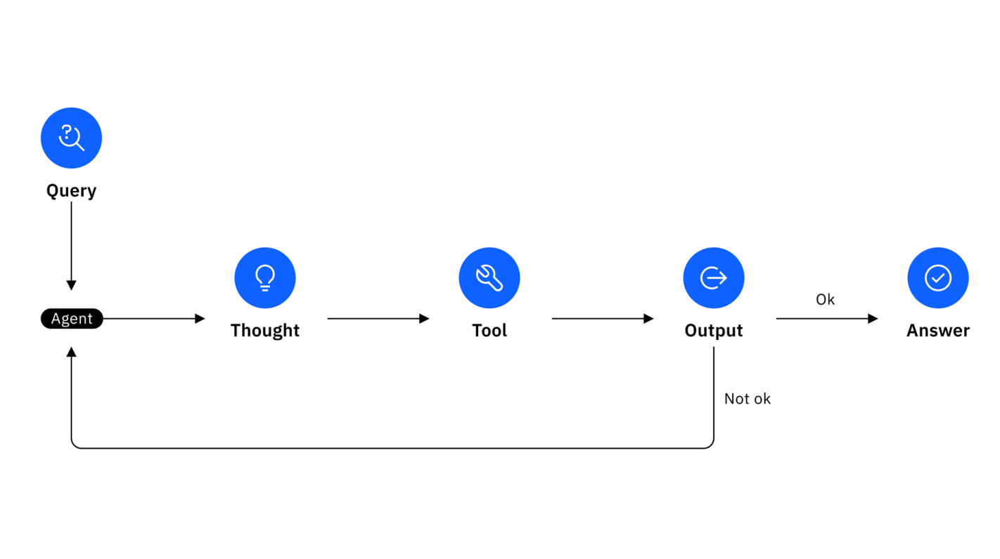

# Initialisation environnement python

## UV

```bash
uv .venv
source .venv/bin/activate
uv sync
```

ajout de packages :

```bash
uv add langchain langchain-community langchainhub openai
```

## PIP

```bash
python -m venv .venv
source .venv/bin/activate
pip install -r requirements.txt
```

## Images Docker 

A part Ollama, 2 images sont utilisées avec le code du dépôt : `agent-tools` et `streamlit`

Les 2 images utilisées dans le docker-compose.yml peuvent être construites 

```bash
$ docker compose build # construit les 2 : agent-tools et streamlit 
$ docker compose build agent-tools # construit uniquement l'image agent-tools
$ docker compose build streamlit # construit uniquement l'image streamlit
```

Lancer l'ensemble :

```bash
$ docker compose up
```

3 images sont disponibles :

```bash
└─ $ ▶ docker ps
CONTAINER ID   IMAGE             COMMAND                  CREATED          STATUS                    PORTS                                             NAMES
3eedb68d1d6f   streamlit-tools   "streamlit run app.p…"   50 minutes ago   Up 50 minutes             0.0.0.0:8501->8501/tcp, [::]:8501->8501/tcp       streamlit
05d574d57a0c   agent-tools       "uvicorn main:app --…"   50 minutes ago   Up 50 minutes             0.0.0.0:8000->8000/tcp, [::]:8000->8000/tcp       agent-tools
c589447fbee0   ollama/ollama     "/bin/sh -c 'ollama …"   50 minutes ago   Up 50 minutes (healthy)   0.0.0.0:11434->11434/tcp, [::]:11434->11434/tcp   ollama
```

## paradigme ReAct

LangChain utilise le mode ReAct, Reasonning Acting pour déterminer le tool à utiliser selon la question posée.

🧠 Idée clé

Plutôt que de faire uniquement du raisonnement en texte (comme un assistant conversationnel) ou uniquement appeler des outils, le modèle fait les deux en alternance :

Think → Act → Observe

**Boucle de raisonnement où le LLM :**

raisonne sur la tâche (via du texte, ex. "Je dois chercher la météo")

agit en appelant un outil externe (ex. appeler une API météo)

observe le résultat retourné (ex. "Il fera 28°C à Paris")

réagit et continue à raisonner ou à agir jusqu’à la réponse finale

Schéma :



# Tools

Tous les tools utilisent des API ne nécessitant pas de clé d'API.

- l'API météo utilisée est : https://open-meteo.com/ - ne nécessite pas de clé d'API, open-meteo permet de récupérer les prévisions météo à 7 jours pour une ville donnée, avec les températures minimales et maximales, ainsi que les précipitations à partir des coordonnées géographiques (latitude et longitude).
- l'API de géocodage sera utilisée pour obtenir les coordonnées GPS : https://nominatim.openstreetmap.org/ (autre alternative : https://geocoding-api.open-meteo.com/v1/search), User-Agent doit être identifié dans les headers de la requête
- l'API des cryptomonnaies : https://min-api.cryptocompare.com/data/price?fsym=BTC&tsyms=EUR&e=CCCAGG
- l'API des jours fériés en France : https://calendrier.api.gouv.fr/jours-feries/metropole/2025.json
- l'API des vacances scolaires en France : https://data.education.gouv.fr/api/records/1.0/search/?dataset=fr-en-calendrier-scolaire&q=&sort=-start_date&facet=description&facet=start_date&facet=end_date&facet=annee_scolaire&refine.location=Paris&refine.annee_scolaire=2024-2025

# Lancer les serveurs

```bash
$ docker compose up
```

OU par l'environnement virtuel

```bash
cd mcp_server
uvicorn main:app --reload
```

- L'API est disponible à l'adresse suivante : http://127.0.0.1:8000/docs

- L'interface Streamlit à l'adresse suivante : http://localhost:8501/

- les *tools* sont disponibles à l'adresse : http://127.0.0.1:8000/mcp/tools
- un appel vers le tool `mcp` est disponible à l'adresse : http://127.0.0.1:8000/mcp/tool_call avec le schéma MCP

```json
{
  "name": "get_weather",
  "parameters": {
    "city": "Paris"
  }
}
```
par exemple avec la commande `curl` :

```bash
curl -X POST http://127.0.0.1:8000/mcp/tool_call \
  -H "Content-Type: application/json" \
  -d '{
    "name": "get_weather",
    "parameters": {
      "city": "Paris, France"
    }
  }'
  {"result":"Prévisions météo pour les 3 prochains jours :\n- 2025-07-31 : 16.3°C → 26.1°C, pluie : 0.2 mm\n- 2025-08-01 : 18.0°C → 24.9°C, pluie : 0.2 mm\n- 2025-08-02 : 14.8°C → 23.5°C, pluie : 0.0 mm\n"}
```
les coordonnées de la ville sont récupérées via l'API de géocodage, puis la météo est récupérée via l'API météo.

```bash
curl -X POST http://127.0.0.1:8000/mcp/tool_call \
  -H "Content-Type: application/json" \
  -d '{
    "name": "get_coordinates_openstreetmap",
    "parameters": {
      "city": "Paris, France"
    }
  }'
  {"result":"Coordonnées de Paris : latitude = 48.8588897, longitude = 2.3200410"}
```

demander au LLM de faire une requête vers le tool `mcp` :

```bash
curl -X 'GET' \
  'http://127.0.0.1:8000/ask?question=quel%20est%20le%20temps%20%C3%A0%20Paris%20%3F' \
  -H 'accept: application/json'
```

```bash
curl --get --data-urlencode "question=Quelle est la météo des 3 prochains jours à Bordeaux, France ?" http://127.0.0.1:8000/ask
```

# Exemples sorties

A la question "quelle est la météo des 3 prochains jours à Bordeaux ?" 
Curl :
```bash
curl -X 'GET' \
  'http://127.0.0.1:8000/ask?question=quelle%20est%20la%20m%C3%A9t%C3%A9o%20des%203%20prochains%20jours%20%C3%A0%20Bordeaux%20%3F' \
  -H 'accept: application/json'
```
Sortie et réponse :

```bash
> Entering new AgentExecutor chain...
2025-08-02 11:20:12 - openai._base_client - DEBUG - Request options: {'method': 'post', 'url': '/chat/completions', 'files': None, 'idempotency_key': 'stainless-python-retry-67bb945b-42b0-42d5-8129-da9f5b21a9de', 'json_data': {'messages': [{'role': 'user', 'content': 'An
swer the following questions as best you can. You have access to the following tools:\n\nget_weather(city: str) -> str - Renvoie les prévisions météo pour une ville donnée. description obligatoire pour tool\n\nUse the following format:\n\nQuestion: the input question you
 must answer\nThought: you should always think about what to do\nAction: the action to take, should be one of [get_weather]\nAction Input: the input to the action\nObservation: the result of the action\n... (this Thought/Action/Action Input/Observation can repeat N times
)\nThought: I now know the final answer\nFinal Answer: the final answer to the original input question\n\nBegin!\n\nQuestion: quelle est la météo des 3 prochains jours à Bordeaux ?\nThought:'}], 'model': 'mistral', 'n': 1, 'stop': ['\nObservation:', '\n\tObservation:'],
'stream': False, 'temperature': 0.0}}
2025-08-02 11:20:12 - openai._base_client - DEBUG - Sending HTTP Request: POST http://localhost:11434/v1/chat/completions
2025-08-02 11:20:12 - httpcore.connection - DEBUG - connect_tcp.started host='localhost' port=11434 local_address=None timeout=None socket_options=None
2025-08-02 11:20:12 - httpcore.connection - DEBUG - connect_tcp.complete return_value=<httpcore._backends.sync.SyncStream object at 0x7f5595d76b30>
2025-08-02 11:20:12 - httpcore.http11 - DEBUG - send_request_headers.started request=<Request [b'POST']>
2025-08-02 11:20:12 - httpcore.http11 - DEBUG - send_request_headers.complete
2025-08-02 11:20:12 - httpcore.http11 - DEBUG - send_request_body.started request=<Request [b'POST']>
2025-08-02 11:20:12 - httpcore.http11 - DEBUG - send_request_body.complete
2025-08-02 11:20:12 - httpcore.http11 - DEBUG - receive_response_headers.started request=<Request [b'POST']>
2025-08-02 11:20:24 - httpcore.http11 - DEBUG - receive_response_headers.complete return_value=(b'HTTP/1.1', 200, b'OK', [(b'Content-Type', b'application/json'), (b'Date', b'Sat, 02 Aug 2025 09:20:24 GMT'), (b'Content-Length', b'434')])
2025-08-02 11:20:24 - httpx - INFO - HTTP Request: POST http://localhost:11434/v1/chat/completions "HTTP/1.1 200 OK"
2025-08-02 11:20:24 - httpcore.http11 - DEBUG - receive_response_body.started request=<Request [b'POST']>
2025-08-02 11:20:24 - httpcore.http11 - DEBUG - receive_response_body.complete
2025-08-02 11:20:24 - httpcore.http11 - DEBUG - response_closed.started
2025-08-02 11:20:24 - httpcore.http11 - DEBUG - response_closed.complete
2025-08-02 11:20:24 - openai._base_client - DEBUG - HTTP Response: POST http://localhost:11434/v1/chat/completions "200 OK" Headers({'content-type': 'application/json', 'date': 'Sat, 02 Aug 2025 09:20:24 GMT', 'content-length': '434'})
2025-08-02 11:20:24 - openai._base_client - DEBUG - request_id: None
 To find out the weather forecast for the next three days in Bordeaux, I will use the get_weather tool.

Action: get_weather
Action Input: Bordeaux2025-08-02 11:20:24 - weather_logger - DEBUG - Récupération des prévisions météo pour Bordeaux
/mnt/d/wutemp/p8/workspace/mcp-weather/mcp_server/weather_tools.py:14: LangChainDeprecationWarning: The method `BaseTool.__call__` was deprecated in langchain-core 0.1.47 and will be removed in 1.0. Use :meth:`~invoke` instead.
  lat, lon = get_coordinates_openmeteo(city)
2025-08-02 11:20:24 - urllib3.connectionpool - DEBUG - Starting new HTTPS connection (1): geocoding-api.open-meteo.com:443
2025-08-02 11:20:24 - urllib3.connectionpool - DEBUG - https://geocoding-api.open-meteo.com:443 "GET /v1/search?name=Bordeaux&count=1 HTTP/1.1" 200 609
2025-08-02 11:20:24 - weather_logger - DEBUG - Latitude : 44.84044 - Longitude : -0.5805
2025-08-02 11:20:24 - urllib3.connectionpool - DEBUG - Starting new HTTPS connection (1): api.open-meteo.com:443
2025-08-02 11:20:24 - urllib3.connectionpool - DEBUG - https://api.open-meteo.com:443 "GET /v1/forecast?latitude=44.84044&longitude=-0.5805&daily=temperature_2m_max%2Ctemperature_2m_min%2Cprecipitation_sum&timezone=auto HTTP/1.1" 200 None
Météo pour Bordeaux : Prévisions météo pour les 3 prochains jours :
- 2025-08-02 : 16.9°C → 25.0°C, pluie : 0.0 mm
- 2025-08-03 : 15.7°C → 27.4°C, pluie : 0.0 mm
- 2025-08-04 : 16.8°C → 31.9°C, pluie : 0.0 mm

Observation: Prévisions météo pour les 3 prochains jours :
- 2025-08-02 : 16.9°C → 25.0°C, pluie : 0.0 mm
- 2025-08-03 : 15.7°C → 27.4°C, pluie : 0.0 mm
- 2025-08-04 : 16.8°C → 31.9°C, pluie : 0.0 mm

Thought:2025-08-02 11:20:24 - openai._base_client - DEBUG - Request options: {'method': 'post', 'url': '/chat/completions', 'files': None, 'idempotency_key': 'stainless-python-retry-fb7ef3ad-13a6-492a-8686-00f0f3558751', 'json_data': {'messages': [{'role': 'user', 'conte
nt': 'Answer the following questions as best you can. You have access to the following tools:\n\nget_weather(city: str) -> str - Renvoie les prévisions météo pour une ville donnée. description obligatoire pour tool\n\nUse the following format:\n\nQuestion: the input ques
tion you must answer\nThought: you should always think about what to do\nAction: the action to take, should be one of [get_weather]\nAction Input: the input to the action\nObservation: the result of the action\n... (this Thought/Action/Action Input/Observation can repeat
 N times)\nThought: I now know the final answer\nFinal Answer: the final answer to the original input question\n\nBegin!\n\nQuestion: quelle est la météo des 3 prochains jours à Bordeaux ?\nThought: To find out the weather forecast for the next three days in Bordeaux, I
will use the get_weather tool.\n\nAction: get_weather\nAction Input: Bordeaux\nObservation: Prévisions météo pour les 3 prochains jours :\n- 2025-08-02 : 16.9°C → 25.0°C, pluie : 0.0 mm\n- 2025-08-03 : 15.7°C → 27.4°C, pluie : 0.0 mm\n- 2025-08-04 : 16.8°C → 31.9°C, plui
e : 0.0 mm\n\nThought:'}], 'model': 'mistral', 'n': 1, 'stop': ['\nObservation:', '\n\tObservation:'], 'stream': False, 'temperature': 0.0}}
2025-08-02 11:20:24 - openai._base_client - DEBUG - Sending HTTP Request: POST http://localhost:11434/v1/chat/completions
2025-08-02 11:20:24 - httpcore.http11 - DEBUG - send_request_headers.started request=<Request [b'POST']>
2025-08-02 11:20:24 - httpcore.http11 - DEBUG - send_request_headers.complete
2025-08-02 11:20:24 - httpcore.http11 - DEBUG - send_request_body.started request=<Request [b'POST']>
2025-08-02 11:20:24 - httpcore.http11 - DEBUG - send_request_body.complete
2025-08-02 11:20:24 - httpcore.http11 - DEBUG - receive_response_headers.started request=<Request [b'POST']>
2025-08-02 11:21:31 - httpcore.http11 - DEBUG - receive_response_headers.complete return_value=(b'HTTP/1.1', 200, b'OK', [(b'Content-Type', b'application/json'), (b'Date', b'Sat, 02 Aug 2025 09:21:31 GMT'), (b'Content-Length', b'564')])
2025-08-02 11:21:31 - httpx - INFO - HTTP Request: POST http://localhost:11434/v1/chat/completions "HTTP/1.1 200 OK"
2025-08-02 11:21:31 - httpcore.http11 - DEBUG - receive_response_body.started request=<Request [b'POST']>
2025-08-02 11:21:31 - httpcore.http11 - DEBUG - receive_response_body.complete
2025-08-02 11:21:31 - httpcore.http11 - DEBUG - response_closed.started
2025-08-02 11:21:31 - httpcore.http11 - DEBUG - response_closed.complete
2025-08-02 11:21:31 - openai._base_client - DEBUG - HTTP Response: POST http://localhost:11434/v1/chat/completions "200 OK" Headers({'content-type': 'application/json', 'date': 'Sat, 02 Aug 2025 09:21:31 GMT', 'content-length': '564'})
2025-08-02 11:21:31 - openai._base_client - DEBUG - request_id: None
 I now know the final answer
Final Answer: Les prévisions météo pour les 3 prochains jours à Bordeaux sont suivantes :
- 2025-08-02 : 16.9°C → 25.0°C, pluie : 0.0 mm
- 2025-08-03 : 15.7°C → 27.4°C, pluie : 0.0 mm
- 2025-08-04 : 16.8°C → 31.9°C, pluie : 0.0 mm

> Finished chain.
INFO:     127.0.0.1:47932 - "GET /ask?question=quelle%20est%20la%20m%C3%A9t%C3%A9o%20des%203%20prochains%20jours%20%C3%A0%20Bordeaux%20%3F HTTP/1.1" 200 OK
```