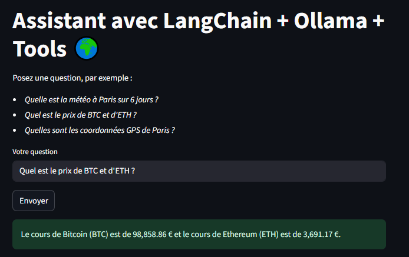
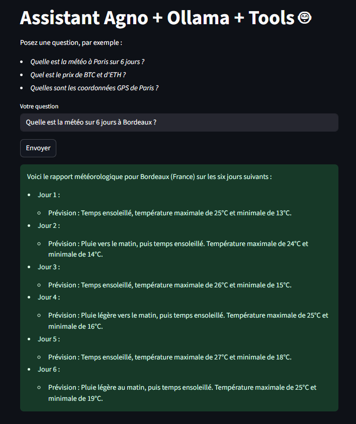
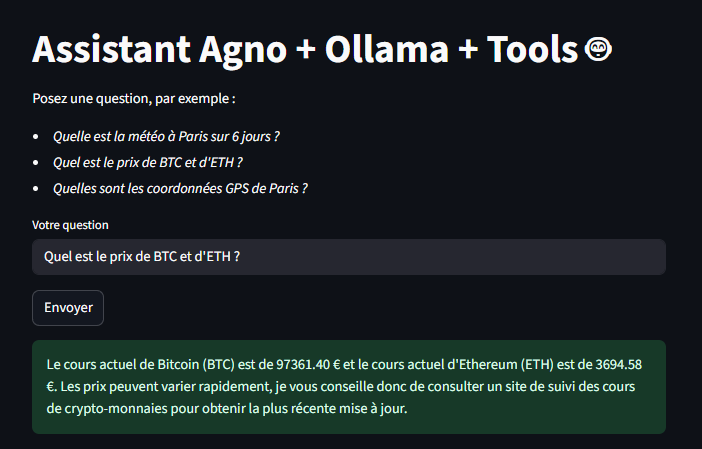

# Expérimentation Agent et tools en local

## Tools avec LangChain en python

> Branche https://github.com/zorky/mcp-weather/tree/mcp-weather-ollama-langchain

- [LangChain](https://python.langchain.com/docs/concepts/tools/ ) pour le chainage de traitement des tools en mode ReAct (Reasoning and Acting)
- Ollama pour le serveur local LLM : .env pour choisir le modèle, par défaut `mistral`
- FastAPI pour l'API /ask
- Streamlit pour l'interface web
- docker avec 2 images à construire : agent-tools et streamlit-tools

Les toolkits de LangChain https://python.langchain.com/docs/integrations/tools/

### Sources, branche et lancer

- git clone git@github.com:zorky/mcp-weather.git
- cd mcp-weather
- git switch mcp-weather-ollama-langchain
- docker compose build
- docker compose up

L'interface Streamlit est disponible sur http://localhost:8501

## Tools avec Agno en python

> Branche https://github.com/zorky/mcp-weather/tree/tools-ollama-agno

- [Agno](https://docs.agno.com/introduction) pour le chainage de traitement des tools en ReAct (Reasoning and Acting)
- Ollama pour le serveur local LLM : .env pour choisir le modèle, par défaut `mistral`
- FastAPI pour l'API /ask
- Streamlit pour l'interface web
- docker avec 2 images à construire : agent-tools et streamlit-tools

Les toolkits de Agno https://docs.agno.com/integrations/tools/

 ### Sources, branche et lancer

- git clone git@github.com:zorky/mcp-weather.git
- cd mcp-weather
- git switch tools-ollama-agno
- docker compose build
- docker compose up

L'interface Streamlit est disponible sur http://localhost:8501

